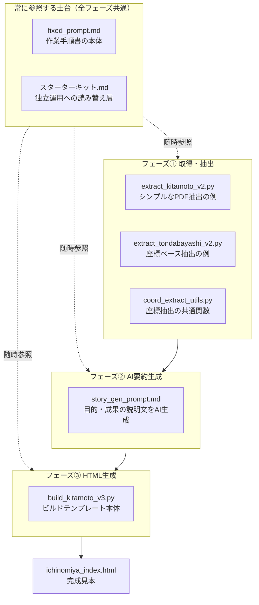

# 事務事業優先度評価ツール スターターキット

行政が公表しているPDF形式の「事務事業評価シート」を住民が読みやすい形に構造化し、住民自身が個々の事業を評価・共有できるツールを、任意の自治体向けに作るためのビルド一式です。

すでに動いている本体ツール（住民向け）は [onuma-spec/jimujigyou-hyoka](https://github.com/onuma-spec/jimujigyou-hyoka) で公開しています。このリポジトリは、その仕組みを**自分の自治体でも作りたい人向け**の制作キットです。

行政のPDFは数百ページに及ぶことが多く、住民が読んで判断材料にするのは現実的ではありません。このキットを使うと、住民が「続行・廃止・見直し」を判断できる単一HTMLの評価ツールができあがります（フレームワーク不使用・GitHub Pagesで無料公開可能。投票機能はSupabaseで、自治体版ごとに新規プロジェクトを個別に用意します）。実例として[一宮市版（完成見本）](https://onuma-spec.github.io/jimujigyou-hyoka/ichinomiya_index.html)を触ってみてください。これまで7自治体（142件〜652件の事業数）で実績があります（他の導入自治体一覧は本体リポジトリ参照）。

---

## ビルドの流れ

以下の①〜③は、Claude Code等のAIコーディング支援に本リポジトリ一式を渡し、`スターターキット.md`・`fixed_prompt.md`を指示書として読み込ませて実行してもらう前提です。人が1つ1つ手作業でコードを書くものではありません（判断が必要な場面ではAIから都度確認を求められます）。

- **土台（`fixed_prompt.md`・`スターターキット.md`）**：特定のフェーズに属さず、①〜③すべての作業中に立ち返って参照する手順書。`スターターキット.md`は`fixed_prompt.md`中の個人アカウント固有の記述を上書きする役割
- **フェーズ①（取得・抽出）**：元データのPDF構造に応じて、シンプルな例（`extract_kitamoto_v2.py`）と座標ベースの例（`extract_tondabayashi_v2.py`）のどちらを参考にするか判断する
- **フェーズ②（AI要約生成）**：抽出したデータをもとに、カードに表示する説明文をAIが生成する
- **フェーズ③（HTML生成）**：`build_kitamoto_v3.py`をコピーして自治体固有の値を埋め、最終HTMLを組み立てる
- **完成見本（`ichinomiya_index.html`）**：①〜③を経て実際にできあがったものの実例

カード内の項目（成果セクション・廃止した場合の影響セクション）は、`LABELS.show_outcome` / `LABELS.show_impact` で表示・非表示を選べます。データの有無ではなく、制作者の好み（カードの情報量をどこまで絞るか）で決めてよい項目です。

---

## 自分の自治体版を作る

**対象読者**：AIコーディング支援（Claude Code等、コード実行可能な環境）が使える方。ブラウザのみのAIチャットでは、PDF抽出のデバッグ作業が現実的に困難です。

1. Python 3系環境を用意し、`pip install pdfminer.six pymupdf openpyxl pandas` を実行
2. このリポジトリを手元にダウンロード（clone または ZIP展開）
3. Claude Codeに `スターターキット.md` を読み込ませて開始を指示する（`スターターキット.md`が読み替えの起点。詳細な作業手順は`fixed_prompt.md`側にある）
4. 対象自治体の事務事業評価シート（PDF等）を用意する。手元にない場合はAIと一緒にWeb検索で探す
5. `ichinomiya_index.html`を完成イメージの見本として、①取得・抽出→②AI要約生成→③HTML生成の順に進める

詰まった場合は`fixed_prompt.md`の該当フェーズの記述に戻ってください。

---

## 免責事項

- 本リポジトリのコードは参考実装です。生成されるツールの内容（抽出結果・AI要約・タグ分類）の正確性は、公開前に必ず一次資料（自治体公表の評価シート原本）と照合してください。
- AIによる要約・分類には誤りが生じる可能性があります。住民に公開する前に、必ず人の目で内容を確認してください。
- 各自治体での公開・運用に伴う法令適合性・業務適合性の確認は、利用者の責任で行ってください。

---

## Contributing

新しい自治体版を作った場合は、ぜひ [Issue](../../issues) で教えてください。[本体ツール](https://github.com/onuma-spec/jimujigyou-hyoka)の導入自治体一覧に追加できる場合があります。

バグ報告・ドキュメント改善の提案も歓迎します。

---

## ライセンス

MIT License
